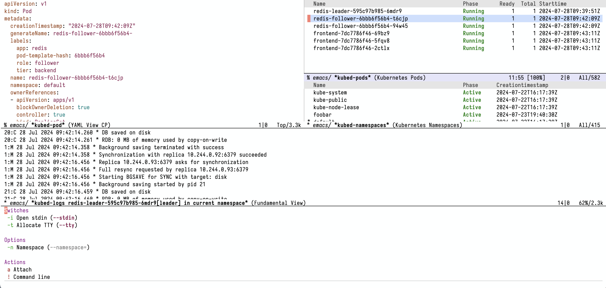
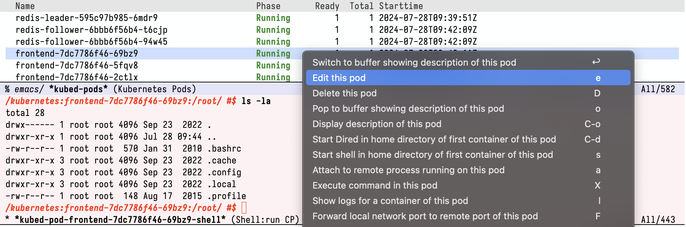
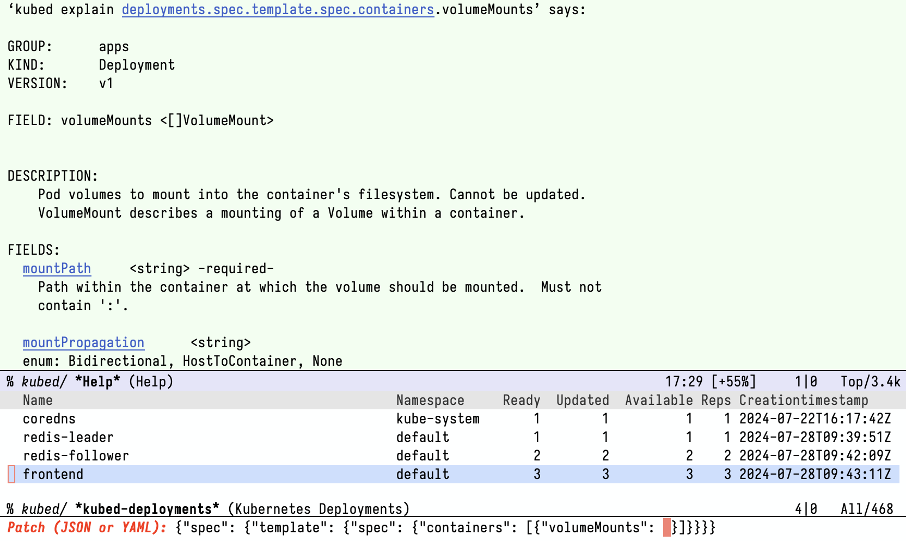

# Kubed

Kubed is a rich Kubernetes interface within Emacs.  It helps you work
with your Kubernetes clusters and deployments with the full power of
`kubectl`, and with the comfort and confidence of an intuitive
interactive interface.

You can use Kubed to:

- Browse and manage Kubernetes workloads
- Connect to pods and edit files or execute commands
- Create new resources, edit and delete them
- Get help about various Kubernetes objects
- ...

# Getting Started

Use your favorite Emacs package manager to install Kubed from Git.  You
can clone the Kubed Git repository from any of the following locations:

- https://git.sr.ht/~eshel/kubed
- https://github.com/eshelyaron/kubed.git
- git://git.eshelyaron.com/kubed.git

To get started with Kubed, all you need is `kubectl` and Emacs.  For
information about usage and customization, see the Kubed manual in Info
or online at https://eshelyaron.com/kubed.html
